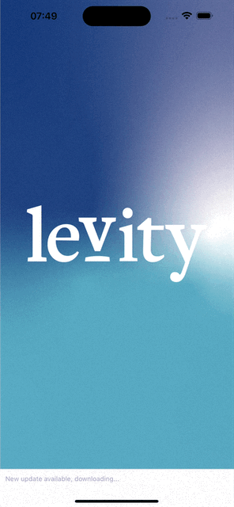

# Animated Splash Screen with Lottie Example in Expo

This example shows you how to create an animated splash screen for your app using Lottie in Expo/React Native.

## 🚀 How to use

- Run `npm install`
- Run `npm run start` to try it out.
- Wait until the app is built and downloaded. Press "run again" to reload the app and splash screen.

